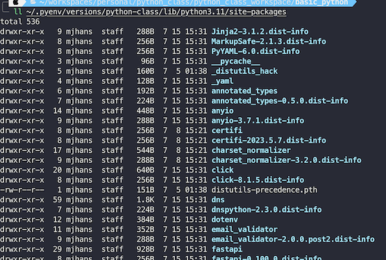
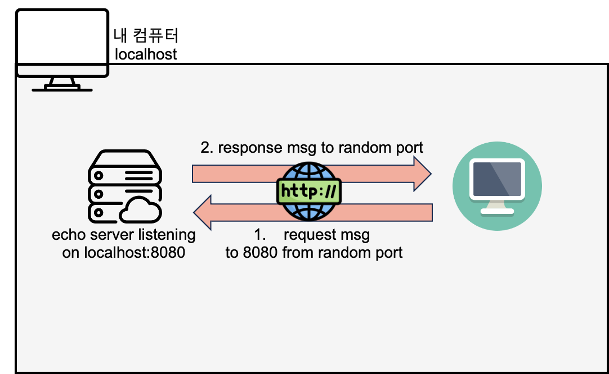

# Practice01

## 1. 값 바꾸기 (Swap)
- 변수 a와 변수 b에 저장된 값을 서로 바꿔서 출력하려면?
```python
a = 5, b = 10
print(f"{a = },  {b = }") # ???
# a와 b를 바꾼다.
print(f"{a = },  {b = }") # ???
```

## 2번 사용자 키보드로 부터 값 입력받기

- input함수를 이용해서 정수를 입력받은뒤 int로 캐스팅하시오
- type 함수를 이용해서 입력받을때 자료형과 캐스팅 이후 자료형을 출력하세요
- 파일이름 : casting.py
- 실행 : python casting.py

## 3번 pip 로 모듈 설치하고, 설치한 모듈을 이용해서 프로그램 만들기

[psutil](https://pypi.org/project/psutil/) : 프로세스, 메모리 등 내 로컬컴퓨터의 정보와 상태를 수집할수 있는 모듈


- `pip install psutil` 명령어로 모듈 설치하기
- 설치되는 경로 확인
  - ` ~/.pyenv/versions/<python-version>/envs/<virtualenv-name>`
  - Symbolic link (shortcut)
    - 
- 파일이름 : psutil_usage.py

## 4번 pip로 에코서버 설치하고, 접속 클라이언트 만들기

### 에코서버 설치하기

[echo server](https://pypi.org/project/restapi-echo-server/) : 내가 보낸 메세지에 같은 메세지로 응답 해주는 서버, 보통 테스트 용으로 많이 사용

- [echo server source](https://github.com/kthrdei/restapi-echo-server/blob/main/src/restapi_echo_server/server.py)

```shell
# terminal을 열어서 pip install restapi-echo-server 을 입력한다
pip install restapi-echo-server

# 에코 서버 실행
python -m restapi_echo_server --host 0.0.0.0 --port 8080

# 접속 테스트
# curl 이 없으면 설치하기
# sudo apt install curl
curl http://127.0.0.1:8080
```

### 클라이언트 만들기



RESTful API 서버에 접속하는 클라이언트를 만드는 가장 쉬운 방법은 requests 모듈을 사용
- [requests 모듈](https://pypi.org/project/requests/)


```bash
pip install requests
```
- 파일 이름 : requests_usage.py
